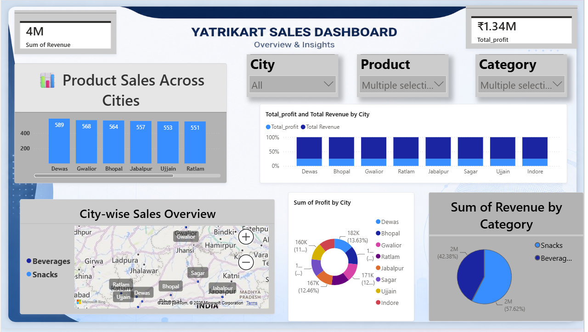
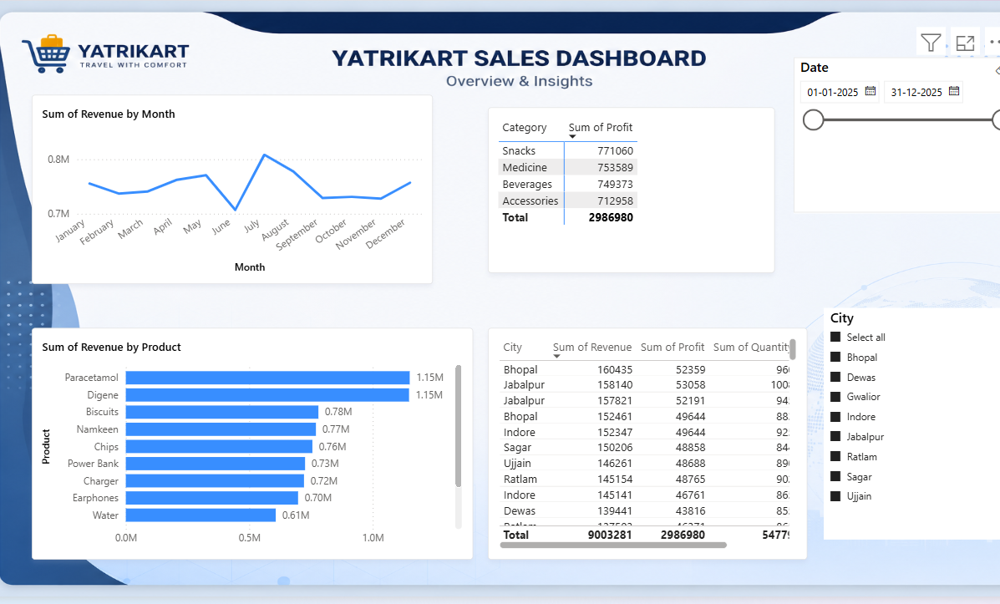

# 🛒 Yatrikart Sales Analytics Dashboard


---

# 📌 Project Overview

The Yatrikart Sales Analytics Dashboard is an interactive Power BI solution designed to analyze sales performance, revenue generation, profitability, product performance, and city-wise business trends.

The dashboard transforms raw transactional data into meaningful business insights, enabling stakeholders to monitor revenue, track profits, identify top-performing products, and evaluate regional sales performance.

---

# 🎯 Business Objective

The primary objectives of this dashboard are:

- Monitor overall sales performance.
- Analyze revenue and profit trends.
- Identify top-performing products.
- Compare city-wise sales performance.
- Evaluate category contribution to revenue.
- Support business decision-making through data-driven insights.

---

# 📷 Dashboard Preview

## Dashboard Overview



## Sales Performance Analysis



---

# 📊 Key Performance Indicators (KPIs)

| KPI | Description |
|------|------------|
| Total Revenue | Overall revenue generated |
| Total Profit | Total profit earned |
| Product Performance | Revenue contribution by product |
| Category Analysis | Profit generated by category |
| City Performance | Revenue and profit by city |
| Monthly Trends | Revenue growth over time |

---

# 📈 Dashboard Features

## 🔹 Revenue Analysis

Monitor:

- Total Revenue
- Revenue by Product
- Revenue by Category
- Revenue by City

Business Benefits:

- Sales monitoring
- Revenue optimization
- Product performance tracking

---

## 🔹 Profit Analysis

Analyze:

- Total Profit
- Profit by Category
- Profit Contribution
- Business Performance Metrics

Insights Generated:

- Most profitable categories
- High-margin products
- Revenue vs Profit comparison

---

## 🔹 Product Performance Dashboard

Track:

- Top-selling products
- Revenue contribution by product
- Product ranking analysis

Examples:

- Paracetamol
- Digene
- Biscuits
- Namkeen
- Chips
- Earphones
- Charger

---

## 🔹 City-wise Sales Analysis

Evaluate sales performance across cities:

- Bhopal
- Indore
- Gwalior
- Jabalpur
- Ratlam
- Dewas
- Ujjain
- Sagar

Business Benefits:

- Regional demand analysis
- Sales expansion planning
- Market performance tracking

---

## 🔹 Monthly Revenue Trends

Analyze revenue performance across:

- January
- February
- March
- April
- May
- June
- July
- August
- September
- October
- November
- December

Insights:

- Seasonal trends
- Revenue fluctuations
- Growth opportunities

---

## 🔹 Interactive Filters

The dashboard includes dynamic slicers for:

- Date
- Product
- Category
- City

This enables detailed drill-down analysis and interactive reporting.

---

# 📊 Key Business Insights

### Revenue Insights

- Revenue remains consistent throughout the year with noticeable growth during peak periods.
- Certain products contribute significantly to overall sales.

### Profitability Insights

- Profit distribution varies across categories.
- Identifying high-profit categories helps improve business strategy.

### Product Insights

- A small number of products contribute a large portion of revenue.
- Product-level analysis supports inventory planning.

### Regional Insights

- Sales performance differs across cities.
- Regional analysis helps identify high-demand markets.

---

# 📂 Dataset Information

The dataset contains:

- Order ID
- Product Name
- Category
- City
- Revenue
- Profit
- Quantity
- Order Date

---

# 🛠 Tools & Technologies Used

### Data Analysis

- Power BI
- Power Query
- DAX

### Data Processing

- Data Cleaning
- Data Transformation
- Data Modeling

### Visualization

- KPI Cards
- Line Charts
- Bar Charts
- Donut Charts
- Maps
- Interactive Slicers
- Tables

---

# 📈 Business Value

This dashboard helps organizations:

✅ Track revenue performance

✅ Monitor profitability

✅ Analyze product demand

✅ Evaluate city-wise sales

✅ Identify business growth opportunities

✅ Support strategic decision-making

---

# 🚀 Future Enhancements

- Sales Forecasting
- Customer Segmentation
- Profit Prediction
- Inventory Forecasting
- Regional Growth Analysis
- Real-Time Dashboard Integration
- Predictive Analytics

---

# 📁 Project Structure

```text
Yatrikart-Sales-Dashboard/
│
├── images/
│   ├── yatrikart_dashboard_1.png
│   └── yatrikart_dashboard_2.png
│
├── Yatrikart_Dashboard.pbix
├── Sales_Data.xlsx
├── README.md
│
└── Assets/
```

---

# 🎓 Skills Demonstrated

- Data Cleaning
- Data Transformation
- Data Modeling
- DAX Calculations
- Dashboard Design
- Business Intelligence
- KPI Development
- Data Storytelling
- Interactive Reporting

---

# 👨‍💻 Author

## Pawan Jogi

**B.Tech – Computer Science & Engineering (Data Science)**

📊 Data Analyst | Power BI Developer | SQL | Python

### 🔗 Connect With Me

- LinkedIn: https://www.linkedin.com/in/pawan-jogi
- GitHub: https://github.com/PawanJogi

---

`Power BI` `Data Analytics` `Business Intelligence` `Sales Dashboard` `Data Visualization` `DAX` `Power Query` `Retail Analytics` `Portfolio Project`
